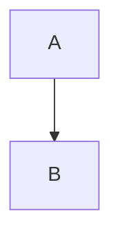

Inline `code` and `` code with `backticks` ``.

```rust
fn main() {
	println!("tab-indented");
}
```

```
plain block without a language
```

    indented code block


```mermaid
graph TD
  A --> B
```
